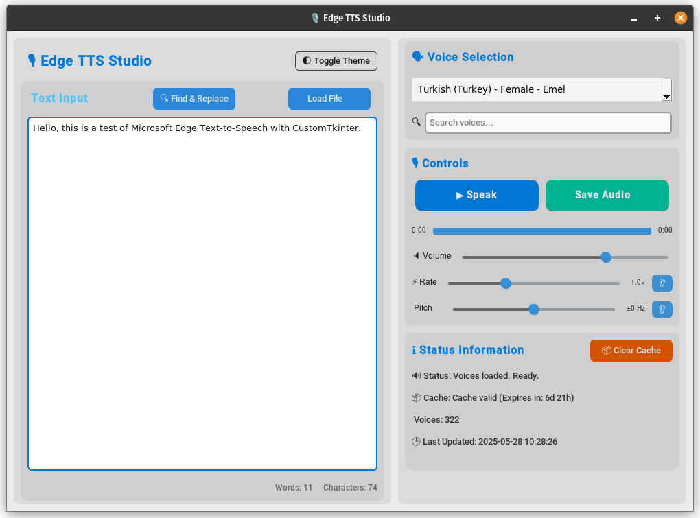

# EdgeTTS-GUI

 


A user-friendly, cross-platform graphical interface for Microsoft's Edge Text-to-Speech service. Built with Python and CustomTkinter, allowing easy text-to-speech conversion with voice selection, playback, and audio file saving.



## Features

- ✅ **Input text area** - Type or paste any text you want to convert
- ✅ **Dynamic voice selection** - Choose from various languages and voice options
- ✅ **Real-time playback** - Listen to the synthesized speech instantly
- ✅ **Save synthesized speech** - Export as MP3 files
- ✅ **User-friendly interface** - Clean and intuitive design
- ✅ **Cross-platform** - Works on Windows, macOS, and Linux

## Installation 🔧

### Windows
1. Download the latest Windows installer (`EdgeTTS-GUI-Setup.exe`) from the [releases page](https://github.com/baturkacamak/EdgeTTS-GUI/releases).
2. Double-click the installer to run it.
3. Follow the simple installation wizard.
4. Launch EdgeTTS-GUI from the Start menu or desktop shortcut.

### macOS
1. Download the latest macOS installer (`EdgeTTS-GUI.dmg`) from the [releases page](https://github.com/baturkacamak/EdgeTTS-GUI/releases).
2. Double-click the downloaded file to open it.
3. Drag EdgeTTS-GUI into your Applications folder.
4. Launch EdgeTTS-GUI from the Applications folder or Launchpad.

### Linux
#### Ubuntu, Debian, and similar:
1. Download the `.deb` package from the [releases page](https://github.com/baturkacamak/EdgeTTS-GUI/releases).
2. Double-click the downloaded file to install using your system's package manager.
3. Launch EdgeTTS-GUI from your applications menu.

#### Fedora, RHEL, and similar:
1. Download the `.rpm` package from the [releases page](https://github.com/baturkacamak/EdgeTTS-GUI/releases).
2. Double-click the downloaded file to install using your system's package manager.
3. Launch EdgeTTS-GUI from your applications menu.

## Development Setup

### Project Structure
```
EdgeTTS-GUI/
├── src/                    # Source code
│   ├── main.py            # Main application file
│   ├── dev.py             # Development utilities
│   ├── utils/             # Utility modules
│   │   └── voice_cache.py # Voice caching functionality
│   └── version.py         # Version information
├── assets/                # Media files
│   ├── icon.ico          # Windows icon
│   ├── icon.png          # Application icon
│   ├── icon.svg          # Vector icon
│   └── icons/            # Additional icons
├── scripts/              # Build and utility scripts
│   ├── build_packages.sh # Package building script
│   └── create_icon.py    # Icon generation script
├── installers/           # Installer configurations
├── releases/            # Built releases
├── requirements.txt     # Python dependencies
├── README.md           # Project documentation
└── BUILD.md           # Build instructions
```

### Setting Up Development Environment

1. Clone the repository:
   ```bash
   git clone https://github.com/baturkacamak/EdgeTTS-GUI.git
   cd EdgeTTS-GUI
   ```

2. Create and activate a virtual environment:
   ```bash
   python -m venv .venv
   source .venv/bin/activate  # On Windows: .venv\Scripts\activate
   ```

3. Install dependencies:
   ```bash
   pip install -r requirements.txt
   ```

4. Run the application:
   ```bash
   python src/main.py
   ```

## How to Use

1. Launch EdgeTTS-GUI from your applications menu
2. Select your preferred language and voice from the dropdown menu
3. Type or paste the text you want to convert to speech
4. Click the "Play" button to hear the speech
5. Use the "Save" button to export the speech as an MP3 file

## Configuration

The application can be customized through the `config.json` file:
- Voice preferences
- Output directory for saved files
- Interface settings

## Contributing

Contributions are welcome! Here's how you can help:

1. Fork the repository
2. Create a new branch (`git checkout -b feature/improvement`)
3. Make your changes
4. Commit your changes (`git commit -am 'Add new feature'`)
5. Push to the branch (`git push origin feature/improvement`)
6. Create a Pull Request

## Building from Source

For detailed build instructions, please refer to [BUILD.md](BUILD.md).

## Credits

This project wouldn't be possible without these amazing open-source projects:

- [EdgeTTS](https://github.com/rany2/edge-tts) - The core TTS engine that powers this GUI application
- [CustomTkinter](https://github.com/TomSchimansky/CustomTkinter) - Modern and customizable Tkinter widgets
- [pygame](https://github.com/pygame/pygame) - Used for audio playback functionality

Special thanks to:
- [rany2](https://github.com/rany2) and all contributors of the EdgeTTS package
- The Microsoft Azure Cognitive Services team for providing the Edge TTS service
- All the contributors who have helped improve this project

## License

This project is licensed under the MIT License - see the LICENSE file for details.

## Contact 📧

For questions, feedback, or support:
- Email: [hello@batur.info](mailto:hello@batur.info)
- GitHub Issues: [Create an issue](https://github.com/baturkacamak/EdgeTTS-GUI/issues)
- Repository: [EdgeTTS-GUI](https://github.com/baturkacamak/EdgeTTS-GUI)